## 一，装修六大步
  ### 1，前期准备
预订装修公司、量尺、出设计方案；
成品保护：电梯口到入户门的地面和墙体，要贴上保护膜。下水管道、地漏、燃气表、线盒要用保护套、或保护盖。
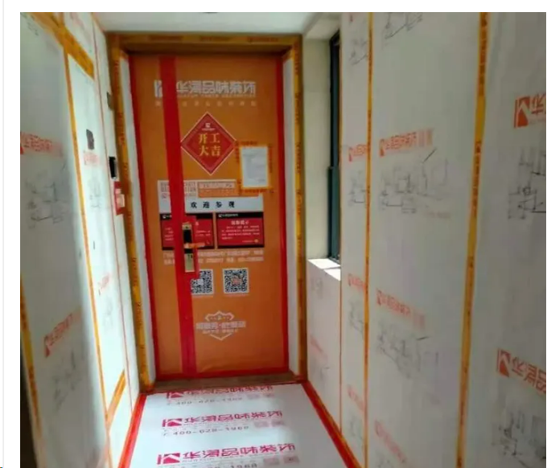

  ### 2，主体拆改
拆除旧窗户，拆墙等结构改造；（最好把橱柜、灶具、热水器等都确定好，以免延误工期。），（拆除不必要的墙体，注意承重墙不能拆。判断是否为承重墙最直接的方式是查看建筑施工图纸，一般图中黑色部分代表承重结构，其余部分代表砖砌或混泥土墙体，虚线部分代表横梁。）
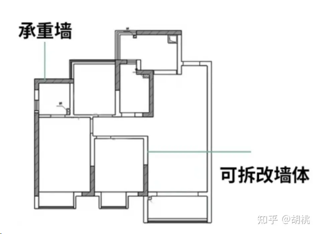

拆除墙体和天花板面漆，也就是铲大白。用铲刀从上到下、从左到右铲除漆面，直到露出水泥层为止。
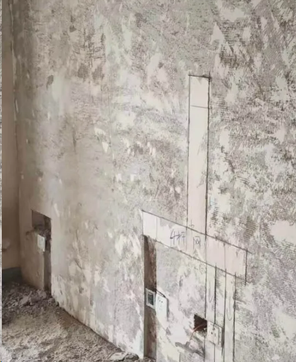

新建隔墙，顶部一层用小砖斜砌成蜈蚣脚，中间是马牙搓样式，底部用不少于3层的小砖做地枕。
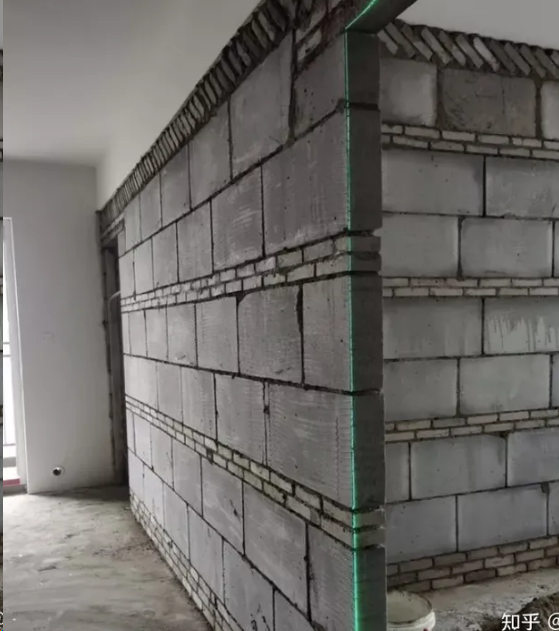

  ### 3，水电改造
（如果有热水器、软水机等可以一起约过来，如果有中央空调、新风、地暖需要和工长协商先后顺序。）；
水电定位，水电施工，水电验收；
1、前期准备
1）预约集合橱柜、中央空调、地暖、新风、中央净水等商家，和水电工一起确认水电点位、管道布局等。
2）确认预埋洁具（入墙花洒、水龙头、壁挂马桶）的尺寸和规格
3）确认天花板吊灯、筒灯、射灯位置和数量
4）确认是用电热水器还是燃气热水器，以及热水器的尺寸和规格

2、施工重点
1）水电定位：确定开关插座、灯具、弱点等电路点位，和给水管、地漏、水龙头等水路点位，在墙上标出点位位置、高度，预估水电配件的数量，和水电改造价格。
2）画线开槽：用水平仪和墨线弹出具体的电路和水路走向，水路开槽深度为25cm左右，电路开槽不超过50cm。
3）铺管道：水电不同槽，冷热水管不同槽，强弱电线不同槽
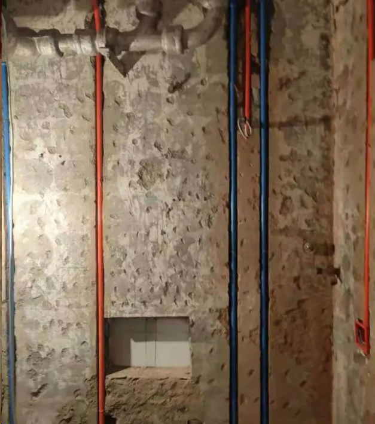

3、水电点位基本高度参考：
1）洗脸盆水龙头高度：800-1000mm
2）洗衣机水龙头高度：1200mm
3）花洒高度：2000 - 2200mm
4）热水器进水高度：1700mm
5）插座高度：400mm
6）开关高度：1200 - 1400cm
7）挂式空调高度：18900mm

4、安装主材：
1）新风/中央空调的主机、地暖、净水系统
2）预埋嵌入式洁具，如安装水龙头、花洒等

5、准备下个环节施工主材：
1）购买瓷砖、窗台石、门槛石、淋浴房挡水条、地漏，在瓦工进场前送到场
2）已定制防盗窗在瓦工进场前送到场
水电是隐蔽工程，猫腻多，又关系到我们的入住安全，一定要亲自到处监工并做好验收。

  ### 4，瓦工施工
厨房卫生间阳台防水，贴墙和铺设地砖；
1，施工要点：
1）卫生间防水：普通墙面防水高度30cm，有淋浴房的墙面防水高度一般要做到180cm；有浴缸、与浴缸相邻的墙面防水高度应比浴缸高处30cm；卫生间里与洗面盆接触的墙面，需要到洗面盆以上30cm。
2）闭水试验：防水完成24小时后做闭水试验，卫生间放满2cm的水，观察24~48小时，记得通知楼下住户，和物业一起检查，观察水位是否明显下降，隔壁墙壁或楼下对应位置有没有渗水痕迹。如果一切正常，那就证明防水做得好，验收通过。
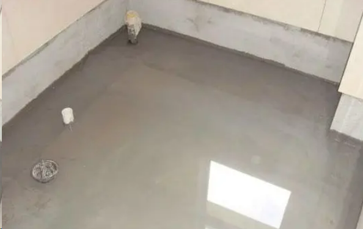

3）包立管：把下水管道包起来之前，叮嘱工人包上隔音棉或者黄金阻尼，避免邻居家的冲水声穿到你家来。用砖包完立管后，要挂一层铁丝网，再贴瓷砖。另外，要记得留一个检修口。
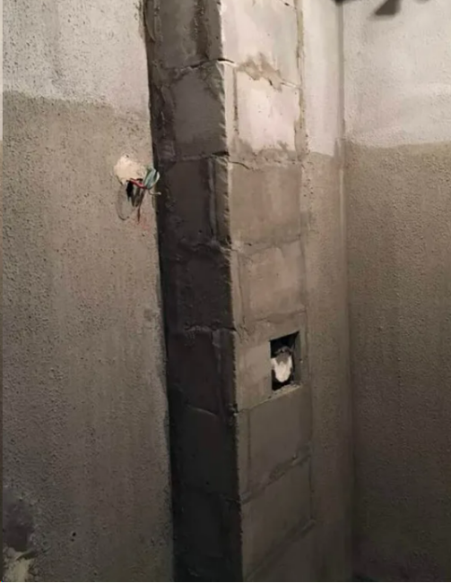
4）铺瓷砖：铺贴瓷砖之前，要根据图纸进行预排，同意一墙面不能有一排以上的非整砖，非整砖应该在次要位置或阴角处。卫生间地面的瓷砖记得要找坡，把地漏放在最低出，才能排水。

2、主材安装：
1）铺砖之前安装防盗窗，方便瓦工师傅收口
2）瓦工进场就可以安装防盗门，瓦工师傅可修正地面高差。

3、准备下个环节施工主材：
1）铺完瓷砖后，联系全屋定制、室内门商家上门量尺
2）订购木地板、踢脚线
相比水电的隐蔽工程，瓦工会直接影响装修质感和颜值，如果瓷砖铺错，装修效果会大大折扣，所以，瓦工也是重点监工和验收的环节。

  ### 5，木工施工
（如果要买成品家具，就需要请商家进场量尺，特别是木门，需要留出门口及地板高度。）现场家具制作，吊灯，木工验收；
1，施工要点
1）按照一般木工顺序，进行的第一项木工施工是吊顶龙骨的架设，并封上石膏板。
2）窗帘盒与吊顶可以同步进行安装，如果家里没有吊顶，也可以让木工直接做一个挡板。
3）如果要铺木地板，则需地面用水泥砂浆进行找平，否则安装后之后，走路会发出吱吱声。
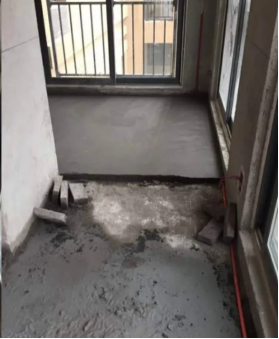

2，安装主材
1）木工现场做的柜子，在这个阶段安装。如果是定制柜，后期等商家安装。
2）安装木工做的隐形门，室内成品门后期再安装。

3、准备下个环节施工主材：
1）购买乳胶漆、墙纸
2）预约全屋定制柜、室内门商家上门安装

  ### 6，油工
1，施工要点
1）成品保护，不需要做油漆的柜体和家具要做好成品保护，之后再开展油漆施工，别弄脏家具。
2）刮腻子，刷漆之前对墙面进行清洁找平，把坑坑洼洼的地方补起来，把前面弄光滑，增加外漆或墙布的附着力。
3）墙面涂料处理，墙面基层处理好后，用乳胶漆在最外层涂刷面漆涂料，或者用壁布进行铺贴。
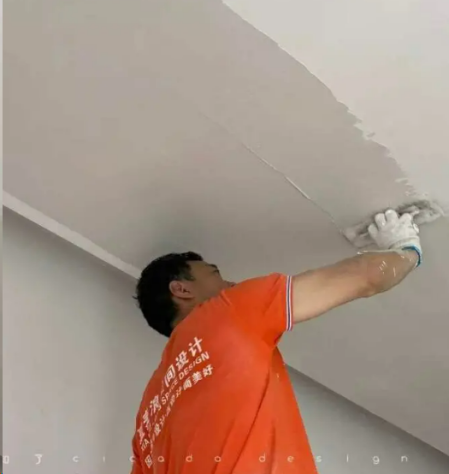

2，主材安装：
1）安装橱柜，提前约好烟机、灶具和水槽。最好同一天送来并跟橱柜一起同时安装。
2）室内门可在地板前安装，主要因为装门步骤复杂，有合页、门锁、门吸、门框等等，所用工具众多，先装室内门，避免损坏木地板。
3）安装木地板、踢脚线。
4）安装鞋柜、衣柜等定制柜

3、准备下个环节施工主材：
1）购买开关、插座、灯具
2）购买提前看好的洁具
3）家具、电器均可下单
4）预约电工施工上门安装开关插座
刷乳胶漆的时候，咱们要注意颜色，一般来说，颜色超过三种或者刷深色人工费会上涨。
  ### 7，各项安装
成品门（再进行一次墙面修补硬装）——窗（拆改完成后，确定窗洞高度，具体数量以及尺寸。）——地板——门套——窗帘——橱柜（拆改完成后橱柜第一次上门量尺，协助出厨房的水电改造图纸。）——灯具安装；

1.厨卫集成吊顶安装；
工期不紧张的可以等油漆全部做好，这样比较卫生。先安装热水器和浴霸，安装好后，吊顶封边才能更好地半包热水器，也就是更美观地衔接了。
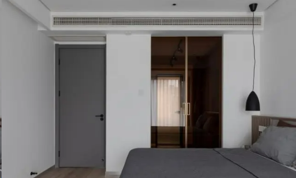

2，开关插座安装
水电阶段已经留好点位，这个环节是最后一步，接好电线，安上面板。

3、灯具安装
水电阶段已经留好了灯具的线头，这个环节可以直接安装灯具，并进行通电测试。

4、马桶安装
马桶安装相对较容易，一般商家负责安装。

5、五金安装（1天）
安装晾衣架、窗帘杆、灯具、洁具、卫浴等五金件，同样建议在装地板前，将这些灰尘散落较多的项目一一搞定。

6、安装完补漆
安装阶段容易环节多，人也多，容易磕碰到墙角，损伤漆面，这时候可以让油漆工对有问题的地方进行修补，给整体硬装画上一个完美的句号。

7、开荒保洁
在硬装完成后，家具家电进场前进行开荒保洁，最好在窗帘安装前完成。

## 二，装修材料
1，主材：地板、瓷砖、壁纸、壁布、吊顶、石材、洁具、橱柜、热水器、水龙头、花洒、水槽、净水机、吸油烟机、灶具、门（拆改完成后，商家上门确定地面高度，确定具体数量和尺寸）、灯具、开关、插座、五金件等。

2，辅材：水泥、沙子、砖头、龙骨、防水材料、水暖管件、电线、腻子、胶、木器漆、乳胶漆、保温隔声材料、地漏、角阀、软连接等。

3，大型设备：新风、中央空调、全屋进水设备、地暖等，装修前就要决定好装不装，开工后再决定，可能延误工期。（拆改完成后，中央空调、新风、地暖、中央净水系统：确定点位、管道布局、打孔位置、以及吊顶方案。）

4，软装：家具、家电、绿植、挂画、摆件等，虽然在最后环节才安装，但要在装修前期确认好尺寸，特别是厨房的家电，否则没有办法预留开关插座。

## 三，装修预算

主材占总预算的40%左右，人工和辅材一起占比20%；
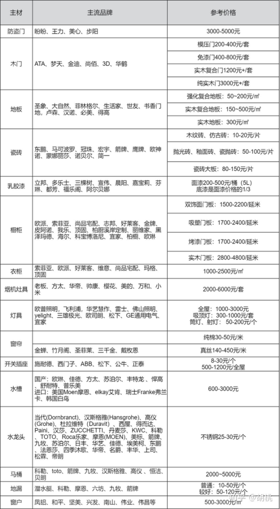

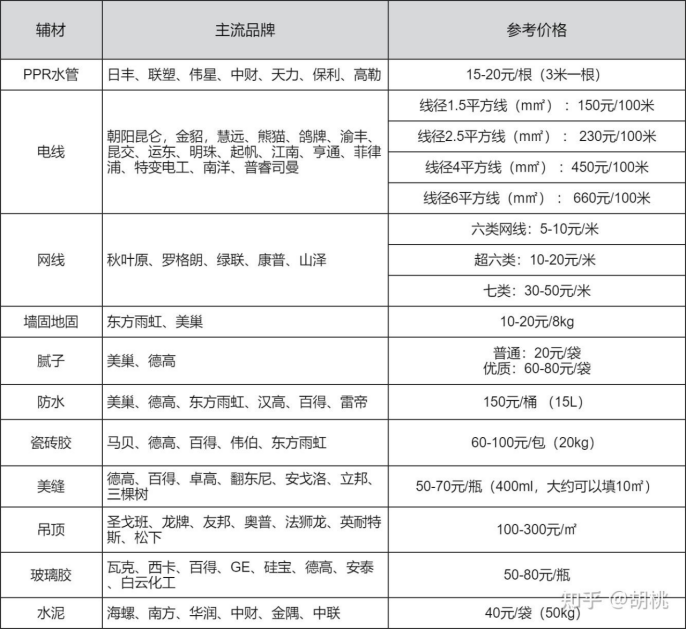

